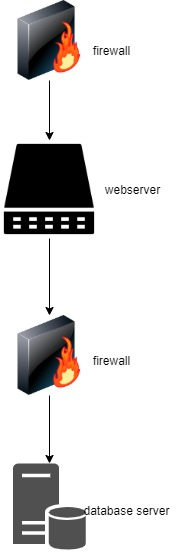
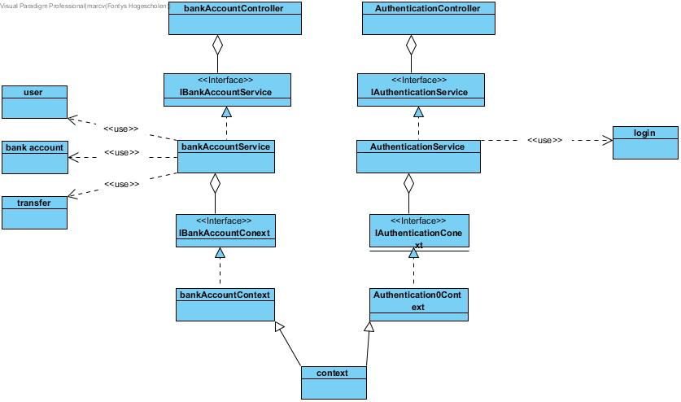

# Bankieren applicatie

De applicatie die ik dit semester ga maken is een bankieren applicatie. De gebruikers kunnen geld overboeken van hun rekening naar een andere rekening. Hierbij kan de gebruiker zelf het bedrag en het ontvangende rekening nummer bepalen. Daarnaast kan de gebruiker ook zijn huidige saldo bekijken. De admin heeft een overzicht van alle transacties. Waarbij de gebruikers data onbekend zijn. Zo kan de admin controleren of er geen verdachte transacties zijn.

## Gebruikers groepen

Ik heb twee gebruikers groepen, de gewone gebruikers groep, wat gewoon de mensen zijn die de applicatie gebruiken. Daarnaast heb ik ook een bank admin gebruikers groep, dit zijn werknemers van de bank die de transacties op verdachte activiteiten moeten controleren.

## Globale architectuur

Ik ga een firewall maken tussen het internet en de webserver om de webserver te beveiligen. Tussen de webserver en de database ga ik ook een firewall maken om de database extra te beveiligen. Ik twijfel nog of ik de frontend en backend op een apparte server zet, dit ga ik waarschijnlijk wel doen als ik genoeg tijd heb.

{: height="450px"}

hieronder staat een diagram met de globale opbouw van de classes en lagen binnen mijn applicatie, ook staan de modellen beschreven.
{: width="650px" }

## Veiligheidsanalyse

Omdat de bankieren applicatie de mogelijkheid heeft om geld over te maken van het ene naar het andere account is het belangrijk om een stricte beveiliging the hebben. Een gat in de beveiliging zou illegale toegang tot een bankrekening kunnen verschaffen, dit zou het legen van deze bankrekening kunnen betekenen. Dit zorgt voor financiele problemen voor de eigenaar van de bankrekening en een beschadigde reputatie van de bank die aan de app verbonden zit.

Data assets

* Login
* Gebruikers account
* Bank admin account
* Transactie

Rollen

* gebruiker
* admin

Permissions

|                    | User  | admin          |
| ------------------ | ----- | -------------- |
| Login              |  -    |      -         |
| Gebruikers account | CRU   | R\*\* D\*\*\*  |
| Bank admin account | CRU   | D\*\*\*\*      |
| Transacties        | CR\*  | C\*\*\*\*\* R  |

\* Gebruikers kunnen alleen transacties in zien van en naar hun eigen bankrekening.
\*\* Admins kunnen alleen gebruikers accounts inzien met de juiste rechtelijke toesteming.
\*\*\* Admins kunnen alleen gebruikers accounts verwijderen met toestemming van de gebruiker.
\*\*\*\* Admins kunnen alleen bankrekeningen verwijderen als het gebruikers account verwijderd is.
\*\*\*\*\* Admins kunnen alleen transacties maken die andere transacties ongedaan maken.

CIA and Privacy

|                    |     C        |  I         |     A     |         P        |
| ------------------ | ------------ | ---------- | --------- | ---------------- |
| Login              | Classified   | Guaranteed | important | Special personal |
| Gebruikers account | Confidential | High       | Required  | Personal         |
| Bank admin account | Confidential | Guaranteed | Required  | Special personal |
| Transacties        | Confidential | Guaranteed | Required  | Special personal |

De login moet versleuteld zijn om voleddig veilig te zijn en daarom is die classified. Al de andere data assets moeten toegankelijk zijn voor de eigenaar en al dan niet voor de bank admin, maar niet voor anderen. Dit is waarom deze confidential zijn.

De gebruikers account mogen niet veranderen zonder de juiste authorizatie maar dat is minder belangrijk dan de andere data assets. Dat is waarom deze niet op gegarandeerd staat.

De login zou zo veel mogelijk toegankelijk moeten zijn maar als het buiten bereik is dan niet het grootste probleem. De rest van het systeem moet altijd online zijn . Dit is omdat het minder erg is als je niet kunt inloggen, maar als je wel kunt inloggen maar dan niet bij je bankrekening kan zou dit voor paniek kunnen zorgen.

Het gebruikers account bevat normale persoonlijke data dat is waarom die op personal staat. De andere data assets worden gezien als special personal omdat ze of wachtwoord of geld gerelateerd zijn.

## Ontwikkel tools and technieken

Ik ga ontwikkelen in asp.net core met een frontend van angular. Hier heb ik voor gekozen omdat ik hier de meeste ervaring mee heb. Ik gebruik entity framework om mijn queries te vergemakkelijke en een extra beveiliging toe te voegen.

Voor de multifactor authenticatie wil ik gebruikt gaan maken van een vinger print scanner om zo de vingerafdruk te verglijken.
