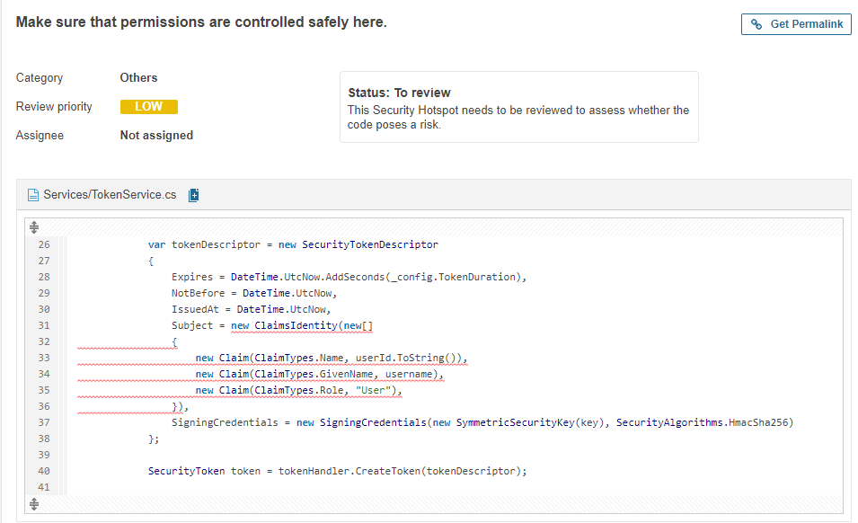

# Static code analysis

Om de code van mijn applicatie te checken op bugs en vulnerabilities moet er een static code analysis worden uitgevoerd. Het programma dat ik hiervoor gebruik is SonarQube. Sonarqube is een van de meeste gebruikte static code analysis tools en bevalt mijzelf ook erg goed. er is een duidelijk overzicht en de fouten worden duidelijk aangegeven met een goede uitleg waarom je het beter niet zo kan doen.

Ik heb sonarqube toegevoegd aan mijn pipeline waardoor er iedere keer als ik mijn pipeline run er automatisch ook een sonarqube analyse wordt gedaan. hierdoor kan ik goed bijhouden of mijn nieuwe code zorgt voor extra bugs en vulnerabilities.

{: }

in de afbeelding hier boven staat de eerste sonarqube analyse die ik gedaan heb. hieruit blijkt dat er nog een groot aantal code smells aanwezig zijn in mijn code. het grootste deel hiervan zijn echter niet gebruikte imports dus dit is snel op te lossen. Dit heb ik dan ook meteen gedaan.

{: }

 Er zijn ook 9 Security hotspots. Dit betekent dat Sonarqube wil dat er een persoon kijkt en besluit of deze veilig zijn omdat de tool dit niet zelf kan. Hierbij geeft sonarqube voor iedere hotspot aan wat het risico is, hoe je weet of jouw programma er last van heeft en hoe je het kan oplossen.

{: }

Sonarqube vind het gebruik van argumenten bij de Main methode het grootste risico. Net zoals alle andere input moeten ze eerste gevalideerd en opgeschoond worden voordat ze gebruikt mogen worden als extra maatregel. ook kunnen gebruikers de lijst van processen van een systeem afhalen wat de argumenten zichtbaar maakt, dit betekend dat deze argumenten geen gevoelige data moeten bezitten.

Dit is een standaard functie die altijd in een asp.net core project zit. Ik heb niks aangepast aan de variabele en deze variabele worden alleen gebruikt door de CreateWebHostBuilder gebruikt. Dit is ook een standaard ASP.net Core methode. Ik weet niet exact wat deze methode doet of wat voor input er exact verwacht wordt. Dit betekend dat ik hier zelf niet de input ga filteren omdat ik verwacht dat microsoft ervoor zorgt dat deze methode veilig is.

Als ik op het internet ga zoeken naar comand injectie op de main methode wordt er gezegd dat je een nieuwe nuget package nodig hebt. Aangezien ik deze niet heb geinstalleerd is dit ook geen reden om dit als risico te zien.

{: }

Volgens Sonarqube kunnen regular expressions zorgen voor een dos vulnerability. Omdat ik meerdere regular expressions gebruik gaat hij hier meerdere keren op af. het vergelijken van regular expressions tegen input strings kan heel cpu intensief zijn. Sommige regular expressions kunnen er erg lang over doen terwijl er equivalenten expressions zijn die veel minder intensief zijn. Dit betekent dat het mogelijk kan zijn om een ReDoS aanval uit te voeren.

{: }

Omdat Sonarqube niet exact weet welke soort encryptie je gebruikt en wat de key('s) zijn geeft hij ook hier een melding. Hij gaat hier af op de encryptie en ontcijfer methode, dus geeft hij deze melding twee keer. Zowel het encryptie algoritme als de key moet sterk zijn, anders kan de encryptie alsnog gebroken worden. Het encryptie algoritme is AES wat tot nu toe sterk genoeg is gebleken. ik gebruik daarbij een 256 bits key die random gegenereerd is. Ook maak ik gebruik van een IV die random gegenereerd is.

{: }

Hier wordt een melding gegeven omdat er een developerExeceptionpage word gebruikt. Deze pagina wordt alleen gebruikt als de enviroment development is, wat nooit zou mogen op een productie omgeving omdat dit voor meer problemen zou kunnen zorgen. Dit betekent dus dat het geen probleem is om dit zo te hebben staan.

{: }

hier wordt een melding gegeven omdat de logger wordt aangemaakt in de startup. Loggers kunnen een doelwit zijn voor hackers omdat er gevoelige informatie in de logs kan zitten. Hier gaat het voornamelijk om hoe de logs zijn ingesteld, wordt er niet te veel gelogd, kunnen de gebruikers bij de logs en zit er een limiet aan de groei van de logs. Ook het fout loggen van informatie kan een probleem vormen. als er uit de log niet gehaald kan worden wat er gebeurt is dit een groot probleem.

Mijn logs worden opgeslagen op een server en laten belangrijke gegevens zoals tijd en de hostname zien. Verder log ik geen persoonsgegevens en laat de logger duidelijk alle waarschuwingen, informatie en error messages zien. Ook zijn er duidelijke grafieken om gevaren nog eerder op te sporen.

{: }

De jwt permissies worden in dit stuk code ingesteld sonarqube geeft aan dat dit een risico kan zijn. Het gaat Sonarqube hier vooral om het veilig opstellen van de permissies en niet zozeer om het feit dat de jwt tokens hier worden ingesteld. Het instellen is veilig maar de vraag is zijn de instellingen veilig. Hebben gebruikers alleen de benodigde rechten en kunnen mensen hun privileges escaleren?

De permissies zijn goed ingesteld en de tokens worden gesigneerd dit betekend dat het niet mogelijk zou moeten zijn om privilege escalatie uit te voeren. Een toegevoegde stap zou kunnen zijn dat een systeem admin privileges weg kan halen van gebruikers om hacker minder lang toegang te geven mochten ze die toch verkregen hebben.

## kennis deling

Toen Casper aan het uitleggen was over code analyse heb ik sonarqube laten zien, hierbij heb ik verteld dat ik sonarqube run via mijn pipeline zodat mijn code automatisch wordt getest. Verder heb ik wat uitgeweid over de functies van sonarqube zoals de code analyse en de security analyse.