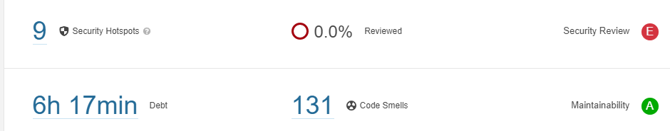
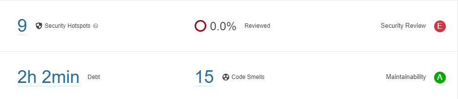
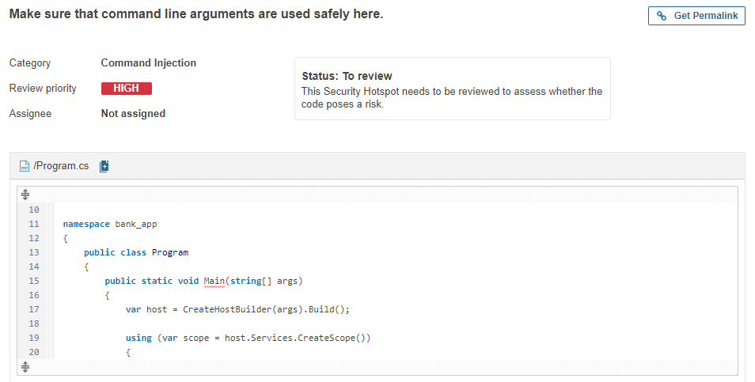
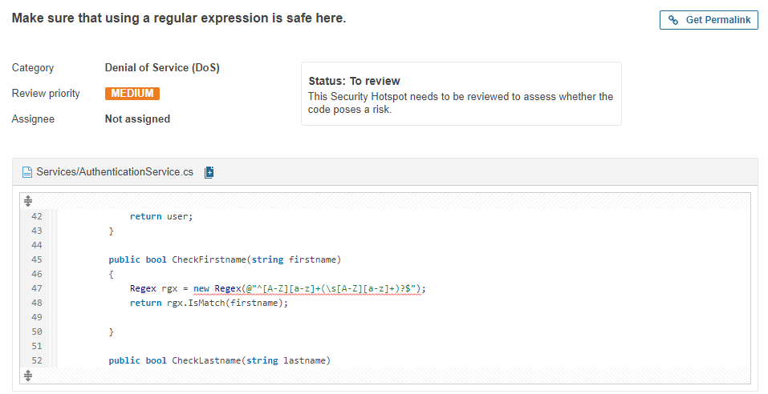
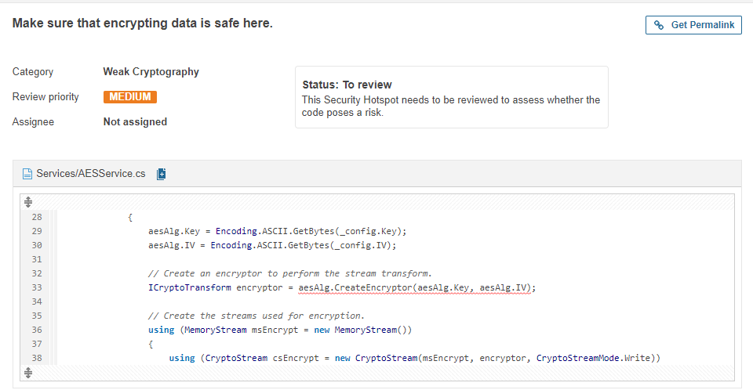
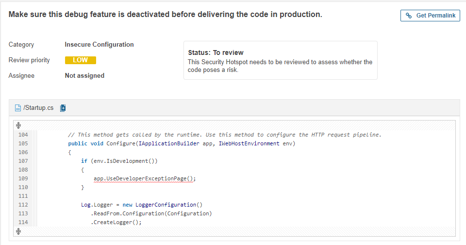
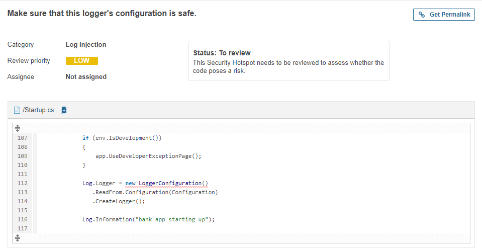

# Static code analysis

Om de code van mijn applicatie te checken op bugs en vulnerabilities moet er een static code analysis worden uitgevoerd. Het programma dat ik hiervoor gebruik is SonarQube. Sonarqube is een van de meeste gebruikte static code analysis tools, en bevalt mijzelf ook erg goed. er is een duidelijk overzicht en de fouten worden duidelijk aangegeven met een goede uitleg waarom je het beter niet zo kan doen.

Ik heb sonarqube toegevoegd aan mijn pipeline waardoor er iedere keer als ik mijn pipeline run er automatisch ook een sonarqube analyse wordt gedaan. hierdoor kan ik goed bijhouden of mijn nieuwe code zorgt voor extra bugs en vulnerabilities.

{: }

in de afbeelding hier boven staat de eerste sonarqube analyse die ik gedaan heb. hieruit blijkt dat er nog een groot aantal code smells aanwezig zijn in mijn code. het grootste deel hiervan zijn echter nietgebruikte imports dus dit is snel op te lossen. Dit heb ik dan ook meteen gedaan.

{: }

 Er zijn ook 9 Security hotspots. Dit betekend dat Sonarqube wil dat er een persoon kijkt en besluit of deze veilig zijn omdat de tool dit niet zelf kan. Hierbij geeft sonarqube voor iedere hotspot aan wat het risico is, hoe je weet of jouw programma er last van heeft en hoe je het kan oplossen.

 {: }

Sonarqube vind het gebruik van argumenten bij de Main methode het grootste risico.

 {: }

Volgens Sonarqube kunnen regular expressions zorgen voor een dos vulnerability. Omdat ik meerdere regular expressions gebruik gaat hij hier meerdere keren op af.

 {: }

Omdat Sonarqube niet exact weet welke soort encrytie je gebruikt en wat de key('s) zijn geeft hij ook hier een melding. Hij gaat hier af op de encryptie en ontcijfer methode, dus geeft hij deze melding twee keer.

 {: }

Hier wordt een melding gegeven omdat er een developerExeceptionpage word gebruikt. Deze pagina wordt alleen gebruikt als de env.development is, wat nooit zou mogen op een productie omgeving omdat dit voor meer problemen zou kunnen zorgen. Dit betekend dus dat het geen probleem is om dit zo te hebben staan.

 {: }

hier wordt een melding gegeven omdat de logger wordt aangemaakt in de startup.

 {: }

De jwt permissies worden in dit stuk code ingesteld sonarqube geeft aan dat dit een risico kan zijn.