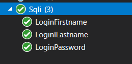
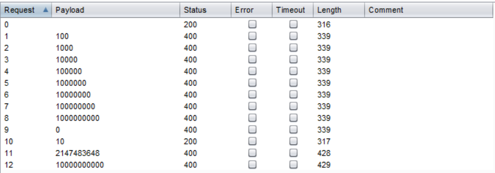

# Fuzzing

Fuzzing is een andere manier om een applicatie te testen. Fuzzing kan op verschillende manieren worden uitgevoerd, maar het hoofd idee is het sturen van data die niet bedoeld is door de ontwikkelaar. Dit kan random data zijn, maar kunnen  ook SQLI strings zijn. Uit de fuzzing testen moet voornamelijk komen of de applicatie goed omgaat met input en errors en niet crashed wanneer er iets vreemds wordt gestuurd.

## SQLI fuzzing

### Burp suite

Als eerste ben ik begonnen met de Burp suite intruder gebruiken om De Sqli lijst die standaard in Kali zit te sturen naar het inlog gedeelte van mijn applicatie. Hierbij heb ik alle 3 de tekst vakken laten invullen met de waarden uit de lijst. Dit was niet perse nodig omdat alles door dezelfde methode afgehandeld word maar is wel naukeuriger. De standaard kali lijst bestaat uit 125 mogelijke sql commando's, omdat ik deze 3 keer laat invullen is de intruder vrij lang bezig.

Een probleem bij deze methode is dat mijn programma gebruik maakt van encryptie, maar de lijst die ik in burp suite heb gezet is plain text. Dit is een mogelijke verklaring voor het feit dat er niks gevonden is. Er zijn twee mogelijkheden om dit op te lossen. De eerste optie is de lijst handmatig versleutelen en dan opnieuw door burpsuite runnen. Deze methode is vrij tijd intensief en als de lijst niet opgeslagen word of veranderd is dit moeilijk te herhalen. De andere optie is unit testen schrijven die deze lijst vertalen en vervolgens naar de applicatie sturen.

### Unit testen

Ik heb 3 login SQL fuzzing testen geschreven. deze testen gebruiken de sql injection lijst van kali linux. bij iedere test probeer ik op een andere variabele de sql te injecteren. Hierbij controleer ik of het resultaat een value heeft. als dit zo is dan is er succesvol ingelogd via sqli anders heeft het systeem de aanval geblokeerd.

{: }

alle drie de testen slagen dit betekend dat mijn login methode beveiligd is tegen sqli aanvallen.

{: }

## Buffer Overflow fuzzing

### unit testen

Ik ben hier begonnen met het schrijven van unit testen omdat deze makkelijker zijn te herhalen als Testen met burp suite. Het probleem hiermee is echter dat de unit test al van te voren errors geeft, dit zorgt ervoor dat de test niet uit te voeren is en daardoor kan er niet gefuzzed worden.

### Burp suite

Omdat burp suite geen beveiliging heeft tegen buffer overflows omdat burpsuite zelf geen last heeft van de bufferoverflow kan ik dit wel testen met Burp suite. als eerste heb ik een integer buffer overflow gedaan op de methode die de bankaccount bij een user ophaalt.

{: }

bij het eerste poging van burp wat een lege input is gooit het programma meteen een error die niet goed wordt afgevangen. Het blijkt dat er geen rekening is gehouden met de mogelijkheid dat de db geen user vind. Dit probleem was niet zomaar gevonden bij normale testen.

Na het toepassen van een kleine verbetering heb ik deze test nogmaals geprobeerd. Hierbij ben ik van 0 tot 10000000000 gegaan en heb ik ook nog speciaal 2147483648. Dit getal heb ik toegevoegd omdat het exact 1 groter is als de maximale integer waarde van asp.net core. bij alle gevallen word nu een 400 badrequest response terug gegeven.

{: }

## conclusie

Het doel en de toegevoegde waarde van fuzzing zijn het testen van applicaties met abnormale waardes en zo proberen errors op te roepen. De onderdelen die ik gefuzzed heb zijn veilig, maar er zijn meer onderdelen van de applicatie die nog niet gefuzzed zijn. zo kan ik nog een fuzzing test schrijven over het overmaken van rare waardes als ik nog tijd over heb kan ik nog meer fuzzing testen schrijven om dit onderdeel verder aan te tonen.
