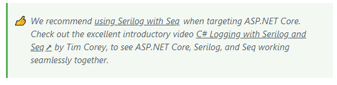
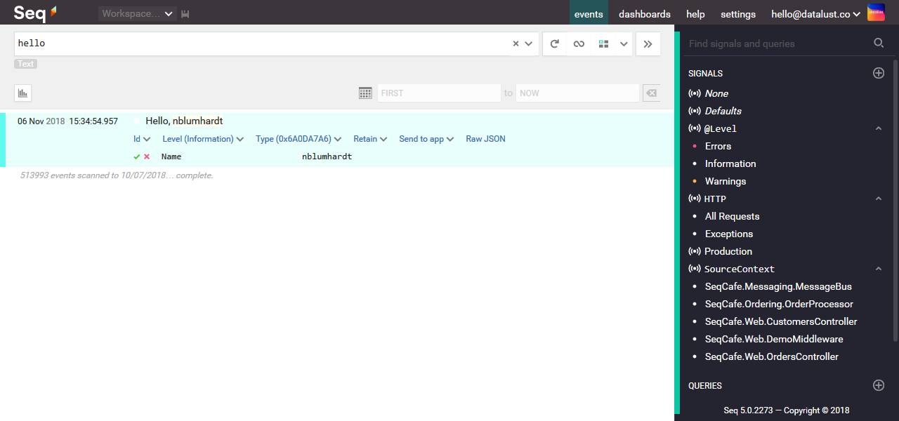

# security logging

Om zeker te zijn dat mijn applicatie veilig is heb ik security logging toegevoegd, op deze manier kan ik mijn applicatie in de gaten houden. De logging zou mij moeten laten zien welke errors er zijn en of de applicatie mogelijk doelwit is van hackers.

## design
Om een duidelijke overzicht te krijgen van mijn log maak ik gebruik van een Seq server die ik zelf opzet. Ik heb ervaring met Seq uit een eerder semester en ben erg tevreden over de mogelijkheden en functies, daarom gebruik ik het dit semester weer. Om de logs van mijn backend naar mijn log server te krijgen gebruik ik serilog. Datalust het bedrijf achter Seq raad zelf aan om Serilog te gebruiken over Microsoft.Extensions.logging. Dit advies hou ik aan.

{: }

logging events:

* mislukte authenticatie
* input validatie fouten
* applicatie errors

als er daadwerkelijk data, zoals een error of parameter, is om weer te geven in Seq wordt het bericht zo geformatteerd: "Hello, {Name}!", Environment.UserName. Hierbij vervangt Seq {Name} door de Environment.UserName. ook komt de Name hierdoor als parameter in het seq log event te staan.

{: }

Binnen de logging wordt er rekening gehouden met de levels die mogelijk zijn. Zo worden Errors als errors gelogd en worden informatie gelogd als informatie. Er zijn meer levels maar die komen terug in de implementatie als ze gebruikt worden. ook worden de log meldingen verrijkt met extra data zoals device data van de gene die de log veroorzaakt heeft. Voor sommige meldingen worden er alerts ingesteld, Dit betekent dat als er een threshold value wordt bereikt er een bericht gestuurd via e-mail of via een messaging service. ook is het mogelijk om health checks te doen via Seq.

## implementatie

Om gebruik te maken van Serilog en Seq moeten er eerst een aantal packages toegevoegd worden aan het project. Dit heb ik als eerste gedaan. vervolgens heb ik de logging in de appsettings aangepast naar de serilog setting. waarbij er in de productie omgeving gebruikt wordt gemaakt van Seq en bij de development alleen van de console. Hiervoor is gekozen omdat de productie omgeving en dus ook de seq server op het seclab moeten runnen en niet vanbuiten af toegankelijk is. Een aparte Seq server opzetten voor development is te tijdsintensief.

vervolgens heb ik in startup een nieuwe logger aan gemaakt. Overal waar ik via Regex controleer of de input voldoet log ik fouten. Bij de authenticatie log ik ook mislukte logins die wel vodoen aan de regex input check. hiermee kunnen bijvoorbeeld bruteforce pogingen gevonden worden.
