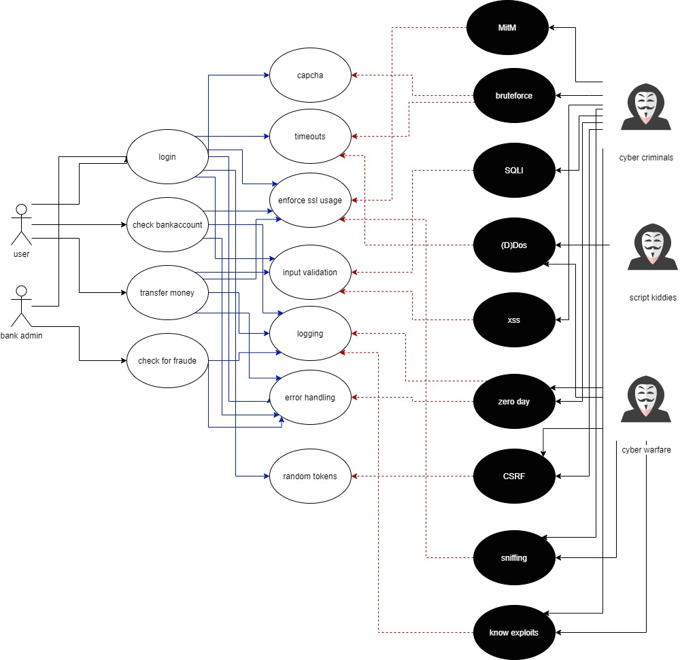

## security architecture

hieronder staat een diagram waarin wordt aangegeven welk onderdeel van de applicatie welke soort beveiliging toepast.

{: }

Om een goed idee te krijgen van het mogelijke misbruik van de applicatie heb ik misusecases gemaakt. Hierin valt te lezen hoe een hacker misbruik zou kunnen proberen te maken van delen van de applicatie. Ook staan er manieren in om de applicatie te beveiligen tegen deze aanvallen.

{: }

Een deel van de bedreigingen zijn direct terug tevinden in dit misusecase diagram. Zo zijn de DDOS aanval en Scriptkiddies direct terug te vinden. Niet alle bedreigingen zijn direct ook aanvallen, de misuse cases zijn gemaakt op de aanvallen uit het misusecase diagram. Bij iedere misusecase is er een rij toegevoegd die aangeeft onder welke bedreiging de misusecase valt.

| naam                     | SQL injectie |
| ------------------------ | ------------ |
| bedreiging               | Data breach persoonsgegevens, stelen vertrouwelijke bedrijfsdata |
| Samenvatting             | Door een gebrek aan filtering kan een gebruiker SQL invoeren en wordt deze uitgevoerd. |
| Beschrijving             | 1. De misactor voert SQL-code in in een textbox 2. De SQL-Server voert deze code uit 3. De misactor krijgt de resultaten terug 4. De misactor kan de hele database uitlezen en zelfs aanpassen|
| Beveiligen               | 1. scheiding van data 2. rollen 3. filteren van gebruikersinput |
| Aannamens                | - |
| grootste risico          | De misactor kan alle data uitlezen, aanpassen en verwijderen |
| Preventie garantie       | b1. De misactor kan wel data inzien en aanpassen, maar niet alles b2. De misactor kan wel data inzien maar niet aanpassen b3. De misactor kan niks |
| Stakeholders and threats | De stakeholders zijn iedereen die de applicatie gebruikt, omdat al deze gegevens kunnen lekken. Het kost veel tijd om alle klanten te bereiken dat er data verloren is. Verder zorgt dit voor een verlies van vertrouwen |
| Scope                    | Alle data opgeslagen in een database.  |
| Ondernomen Stappen       | rollen en filteren van gebruikers input |

| naam                     | XXS |
| ------------------------ | ------------ |
| bedreiging               | Malware Infectie, data breach persoonsgegevens, stelen vertrouwelijke bedrijfsdata |
| Samenvatting             | Door een gebrek aan filtering kan een gebruiker SQL invoeren en wordt deze uitgevoerd. |
| Beschrijving             | 1. De misactor voert JS-code in in een textbox 2. De Client voert deze code uit bij een andere gebruiekr 3. De misactor kan mogelijk cookies stelen de pagina aanpassen en de gebruiker volgen op de pagina |
| Beveiligen               | 1. filteren van gebruikersinput |
| Aannamens                | - |
| grootste risico          | De misactor kan bij alle gebruikers JS uitvoeren |
| Preventie garantie       | b1. De misactor kan niks |
| Stakeholders and threats | De stakeholders zijn alle gebruikers. Het is erg moeilijk om te ontdekken wanneer er misbruik gemaakt wordt van een XSS. |
| Scope                    | Alle pagina's in het systeem.  |
| Ondernomen Stappen       | filteren van gebruikers input |

| naam                     | Account overnamen |
| ------------------------ | ------------ |
| bedreiging               | Data breach persoonsgegevens, phishing |
| Samenvatting             | Door het misbruiken van een exploit kan de misactor toegang krijgen tot een account van een andere gebruiker. |
| Beschrijving             | 1. De misactor gebruikt een exploit om login-token of een gebruikersnaam en wachtwoord te verkrijgen 2. De misactor gebruikt deze gegevens om in te loggen |
| Beveiligen               | 1. 2 factor authentication bij het inloggen 2. alle gebruikers alleen de noodzakelijke rechten geven. 3. tokens een beperkte levensduur geven. |
| Aannamens                | er is een exploit aanwezig in het susteem waarmee iemand deze gegevens kan bemachtigen |
| grootste risico          | De misactor kan bij iemands bankrekening en kan geld overmaken naar andere accounts. |
| Preventie garantie       | b1. de misactor kan niks als hij alleen een gebruikersnaam en wachtwoord heeft b2. de gebruiker kan een alleen dingen doen waar hij rechten voor heeft b3. de misactor heeft minder kans om een token te kunnen gebruiken |
| Stakeholders and threats | De stakeholders is de gebruiker waarvan de inloggegevens zijn gelekt. De schade kan financieel erg groot zijn voor deze gebruiker. |
| Scope                    |   |
| Ondernomen Stappen       | jwt tokens met een beperkte levensduur en alle gebruikers alleen noodzakelijke rechten geven. |

| naam                     | (D)DoS |
| ------------------------ | ------------ |
| bedreiging               | DDOS |
| Samenvatting             | Door een groot aantal request te sturen naar de applicatie kan de misactor de applicatie plat leggen. |
| Beschrijving             | 1. De misactor heeft een bot-net of heeft een DoS-fout in de applicatie gevonden 2. De misactor activeert de aanval |
| Beveiligen               | 1. de firewall instellen om dos berichten te blokkeren 2. een DDoS-blocker gebruiken |
| Aannamens                |  |
| grootste risico          | het systeem is volledig buiten werking voor een onbepaalde tijd |
| Preventie garantie       | b1. Een DoS en sommige DDoS aanval wordt minder waarschijnlijk b2. Een DDoS aanval is niet meer mogelijk maar een DoS-fout nog wel |
| Stakeholders and threats | De stakeholders zijn alle gebruikers. Omdat nietmand de applicatie kan gebruiken kost dit veel tijd en geld |
| Scope                    | De gehele applicatie |
| Ondernomen Stappen       | |

| naam                     | MitM |
| ------------------------ | ------------ |
| bedreiging               | Data breach persoonsgegevens, stelen vertrouwelijke bedrijfsdata |
| Samenvatting             | Door een gebrek aan SSl kan een gebruiker de data die wordt verstuurd van en naar de server lezen. |
| Beschrijving             | 1. De misactor voert een MitM aanval uit op een netwerk waarop de app gebruikt wordt 2. Een gebruiker gebruikt de app  3. De misactor krijgt alle verstuurde data te zien en kan deze aanpassen |
| Beveiligen               | 1. het afdwingen van SSL |
| Aannamens                | - |
| grootste risico          | De misactor kan alle verzonden data uitlezen, aanpassen en verwijderen |
| Preventie garantie       | b1. De misactor kan wel de connecties zien maar de data is versleuteld en dus niet te gebruiken |
| Stakeholders and threats | De stakeholders zijn iedereen die de applicatie gebruikt op het netwerk met de MitM, omdat de server niet kan zien of de data tijdens het verzenden is aangepast kan dit ervoor zorgen dat er geld naar een verkeerd account gestuurd wordt. |
| Scope                    | Alle data die wordt verzonden tussen een client en de server  |
| Ondernomen Stappen       | |

| naam                     | bruteforce |
| ------------------------ | ------------ |
| bedreiging               | Data breach persoonsgegevens, stelen vertrouwelijke bedrijfsdata |
| Samenvatting             | Door een gebrek aan timeouts en capcha's kan een gebruiker oneindig vaak proberen zijn wachtwoord te raden |
| Beschrijving             | 1. De misactor laat een programma proberen om in te loggen door middel van een bruteforce of library attack 2. de server reageert telkens of het inloggen gelukt is 3. De misactor krijgt de resultaten terug uit het programma 4. De misactor kan nu inloggen met een gevonden combinatie van gebruikersnaam en wachtwoord|
| Beveiligen               | 1. timeouts na x keer inloggen 2. capcha's |
| Aannamens                | - |
| grootste risico          | De misactor kan inloggen op andermans account en vanuit daar geld overmaken |
| Preventie garantie       | b1. De misactor kan de aanval wel uitvoeren maar die duurt veel langer b2. bruteforce programma's kunnen niet omgaan met capcha's hierdoor worden bruteforce en library attack's voorkomen. |
| Stakeholders and threats | De stakeholders zijn iedereen die de applicatie gebruikt, omdat er gezocht kan worden naar een combinatie van gebruikersnaam en wachtwoord. een klant kan veel geld verliezen als een hacker inbreekt in zijn of haar account. Verder zorgt dit voor een verlies van vertrouwen |
| Scope                    | Alle accounts.  |
| Ondernomen Stappen       | |

| naam                     | csrf |
| ------------------------ | ------------ |
| bedreiging               | Data breach persoonsgegevens, stelen vertrouwelijke bedrijfsdata |
| Samenvatting             | Door een gebrek aan input filtering kan een misactor request sturen die uit een vertrouwde user lijken te komen |
| Beschrijving             | 1. de misactor steel een token van een gebruiker met de admin rol 2. de misactor stuurt een request naar de website met het gestolen token. De server voert de request uit omdat hij de token vertrouwd. 4.|
| Beveiligen               | 1. korte levensduur tokens 2. random tokens |
| Aannamens                | - |
| grootste risico          | De misactor kan admin functies uitvoeren |
| Preventie garantie       | b1.CSRF Token b2. Omdat de tokens maar een beperkte levensduur hebben is de kans groot dat de misuser een ongeldige token heeft. |
| Stakeholders and threats | De stakeholders zijn de gebruikers waarvan de token gestolen is. De schade is afhankelijk van de rechten van het account. |
| Scope                    | de eigenaar van het token.  |
| Ondernomen Stappen       | jwt tokens met een beperkte levensduur. |

| naam                     | zero day |
| ------------------------ | ------------ |
| bedreiging               | Data breach persoonsgegevens, stelen vertrouwelijke bedrijfsdata, malware infectie |
| Samenvatting             | Doordat er een nieuwe aanval is gevonden kan een misactor misbruik maken van de applicatie |
| Beschrijving             | 1. De misactor voert de zero day aanval uit. |
| Beveiligen               | 1. logging |
| Aannamens                | - |
| grootste risico          | De misactor kan heel de applicatie misbruiken |
| Preventie garantie       | b1. een zero day wordt eerder opgemerkt en kan dus eerder gepatched worden |
| Stakeholders and threats | De stakeholders zijn iedereen die de applicatie gebruikt, omdat de hele applicatie een zero day kan bevatten. een klant kan veel geld verliezen als een hacker inbreekt in zijn of haar account. Verder zorgt dit voor een verlies van vertrouwen |
| Scope                    | de gehele applicatie  |
| Ondernomen Stappen       | |

| naam                     | sniffing |
| ------------------------ | ------------ |
| bedreiging               | Data breach persoonsgegevens, stelen vertrouwelijke bedrijfsdata |
| Samenvatting             | Door een gebrek aan encryptie van de communicatie tussen de client en server kan een misactor het verkeer lezen |
| Beschrijving             | 1. De misactor volgt al het netwerk verkeer van de client of server 2. de server stuurt onversleutelde data naar de client 3. De misactor krijgt de data te zien |
| Beveiligen               | 1. SSl encryptie afdwingen |
| Aannamens                | - |
| grootste risico          | De misactor kan persoonsgegevens of wachtwoorden uitlezen |
| Preventie garantie       | b1. De misactor kan het verkeer nog zien maar de data is versleuteld dus kan de misuser er niks mee |
| Stakeholders and threats | De stakeholders zijn iedereen die de applicatie gebruikt, omdat hun data wordt verstuurd door de app. een klant kan veel geld verliezen als een hacker zijn wachtwoord afleest. Verder zorgt dit voor een verlies van vertrouwen |
| Scope                    | de gehele applicatie  |
| Ondernomen Stappen       | |
