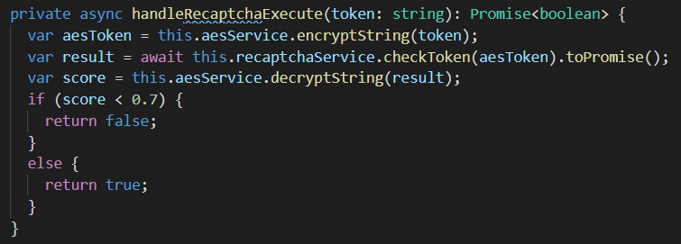

# Captcha

Captcha's worden gebruikt om bruteforce attacks tegen te gaan, dit kan op meerdere manieren gebeuren maar de meest benkende vorm is het aanklikken van foto's met een bepaald voorwerp erop. De bruteforce programma's kunnen deze taak niet uitvoeren en kunnen de applicatie niet bruteforcen.

## Recaptcha

Na wat onderzoek ben ik er achter gekomen dat Recaptcha van google de grootste en meest gebruikte captcha library is. Dit betekend dus dat er veel Community documentatie is waardoor deze library ook makkelijk geimplementeerd kan worden. De library ondersteunt momenteel 2 versies, v2 en v3.

Versie 2 is de meest bekende versie waarbij de gebruiker zelf input moet geven aan de hand van de foto's. versie drie is wat moderner, hierbij hoeft de gebruiker zelf geen input te geven maar wordt er aan de hand van een code bepaald of de poging is gedaan door een computer. De logica achter deze versie is niet openbaar en ik weet dus niet exact wat er hier gebeurt, maar er komt een score uit van 0,0 tot 1,0 die aangeeft hoe groot de kans is dat de poging is gedaan door een mens. Ik heb toch voor versie drie gekozen, omdat deze volgens google zelf beter is en hij vooral ook gebruiksvriendelijker is. De eerste implementatie doe ik bij de login om er zeker van te zijn dat alleen mensen inloggen. Deze methode zou ik ook nog toe kunnen voegen aan de pagina waarop mensen geld overmaken, dit zou een extra beveiliging zijn maar dit is afhankelijk van het feit of er extra tijd is.

## implementatie

eerst heb ik een npm library toegevoegd aan mijn Angular frontend. En heb ik een nieuwe site gemaakt voor google recaptcha zodat ik een sitekey(publickey) en secretkey(privatekey) heb gekregen. Door een provider van deze library toe te voegen was het maken van een token met een call gemaakt. Een bijkomend voordeel van Recaptcha is het feit dat er een admin page bij zit waarbij het aantal requests en de betrouwbaarheid in grafieken worden uitgezet.

{:}

vervolgens heb ik eerst geprobeerd de call om de token te controleren vanuit de frontend te maken, zodat ik niet ook langs mijn backend hoefde. Echter heeft google hier een beveiliging tegen ingebouwd. Dit betekend dat ik de methode naar mijn backend moest verplaatsen. de secret key heb ik weer als environment variabele toegevoegd. waardoor hij niet te achterhalen is. Tijdens het implementeren van de backend methode had ik wat problemen met de documentatie van google, maar met de community documentatie was de oplossing snel gevonden.

{:}

Vervolgens heb ik de frontend zo aangepast dat eerst de recaptcha wordt gechecked, en als de code hoger is als 0,7 en de waarschijnlijkheid dat een persoon de methode heeft uitgevoerd dus 70% is wordt de echte login poging gedaan. Als de score van 0,7 niet gehaald wordt, wordt er ook geen inlog poging gedaan waardoor het moeilijker wordt voor robots om in te loggen.

{:}
