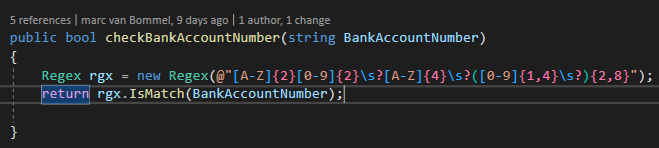

# Regular expression

Ik heb nog niet eerder gewerkt met regular expressions(regex), het ziet er altijd gecompliceerd uit maar ook erg intressant. ik ben dus ook erg benieuwd naar hoe het werkt. Ik weet dat het wordt gebruikt om gebruikers input te controlleren of het voldoet aan bepaalde eisen. 

## functie
Met regex kun je een verzameling tekens aangeven zonder ze allemaal te schrijven. Binnen regex zijn letters en cijfers gewoon zich zelf maar er zijn ook een aantal speciale tekens.

* Een . staat voor ieder mogelijk teken behalve voor een nieuwe lijn.
* [] geven een lijst van mogelijke tekens aan, waarbij de mogelijke tekens tussen de haken staan.
  * Als er binnen vierkante haken een streepje staat betekent dit een reeks, dus [a-z] betekend alle kleine letters van a tot en met z.
  * Een dakje als eerste teken tussen vierkante haken betekend dat de tekens erachter niet in de verzameling voor mogen komen.
* een dakje staat voor het begin van een regel.
* een dollar teken staat voor het eind van een regel.
* een verticale balk staat voor een keuze.
* een + betekend dat het teken ervoor minstens een keer voor moet komen.
* Een ? beteknd dat het teken ervoor hoogstens een keer voor mag komen.
* Een * geeft aan dat het voorgaande teken nul of meer keer voor mag komen.
* Haakjes maaken een eenheid van het patroon waar ze omheen staan.

het is altijd mogelijk om meerdere van deze tekens in een patroon voor te laten komen.

## voorbeelden
Om aan te tonen dat ik snap hoe je met regex omgaat ga ik een aantal voorbeelden maken in mijn eigen code. Hiervoor ga ik een voornaam en achternaam, een bedrag en als laatste een iban controlle opstellen.

de voornaam moet beginnen met een Hoofdletter en moet daarnaar kleine letters en hoofdletters kunnen hebben om ook dubbele voornamen te kunnen bevatten. Om de eerste hoofdletter te vangen moet er begonnen worden met `[A-Z]`. Om daarnaar de kleine letters te kunnen omvangen moet `[a-z]+` worden toegevoegd. De regex string is dan `[A-Z][a-z]+`. Dit regex patroon match alleen enkele namen, maar omdat er ook dubbele namen zijn die een match moeten vormen moet er nog wat worden toegevoegd. Deze toevoeging moet optioneel zijn daarom moet het tussen haken staan met erachter een vraagteken dus wordt het `[A-Z][a-z]+()?`. Tussen de haken moet dan nog een keer de eerste check komen te staan, met als toevoeging een \s voor het checken van de tussenliggende spatie. Dus is de volledige regex check `[A-Z][a-z]+(\s[A-Z][a-z]+)?`

De achternaam check is bijna gelijk alleen hebben sommige namen een voorvoegsel dat niet met een hoofdletter begint maar met een kleine letter. ook hier moet weer een groep van worden gemaakt. deze groep is dus `([a-z]+\s)?`. het vraagteken moet worden toegevoegd omdat ook hier een spatie tussen moet. Daan moet de naamcheck er weer achter, dit maakt de regex expression `([a-z]+\s)?[A-Z][a-z]+`. ook hier moet weer gekeken worden naar mogelijke 2de achternamen. dit betekend dat dezelfde expression nogeens als groep moet worden toegevoegd met een vraag teken om optioneel te zijn. De voledige achternaam check is dus `([a-z]+\s)?[A-Z][a-z]+(-([a-z]+\s)?[A-Z][a-z]+)?` hier wordt alleen geen rekening gehouden met het streepje dat de dubbele achternaam scheid. dit moet dus nog worden toegevoegd tussen als eerste teken tussen de twee namen.

Een bedrag checken is miscchien wat makkelijker als beide naam controlles. maar hierbij moet wel rekening gehouden worden met het bedrag achter de punt. om een geheel bedrag te checken moet is de regex `[0-9]+`. Dit matcht ieder geheel bedrag. vervolgens moet het optionele bedrag achter de punt worden toegevoegd met de expression `(\.[0-9]{2})?`. hierbij geeft de {2} dat het getal achter de punt 2 tekens groot moet zijn. de volledige regex expression is dan `[0-9]+(\.[0-9]{2})?`.

Nu komt de lastigste lijkende expression tot nu toe, het controlleren van een iban. om te beginnen moeten de eerste twee tekens letters zijn dus `[A-Z]{2}`. dan moeten er twee cijfers volgen. dus `[A-Z]{2}[0-9]{2}`. vervolgens moet er weer vier letters komen, dit maakt de regex expression `[A-Z]{2}[0-9]{2}[A-Z]{4}`. Als laatste moeten er cijfers volgen, de hoeveelheid verschilt per land. De kortste iban lengte is 15 van Noorwegen, dit betekend dat er 15 - 8 = 7 cijfers staan. de langste is 31 voor malta, dit betekend dat er 31-8 = 23 cijfers achter staan. Dit betekend dat de volledige regex expression `[A-Z]{2}[0-9]{2}[A-Z]{4}[0-9]{7,23}`. omdat de iban een vrij makkelijke opbouw heeft is dit juist een van de makkelijkere regex expressions. alleen het verschil in lengte van de iban tussen landen maakt het wat moeilijker. Alleen schrijven veel mensen een iban nummer met spatties na iedere vier tekens. hiervoor moet de regex worden aangepast, door achter de `[0-9]{2}` en `[A-Z]{4}` een `\s?` toe te voegen. dit maakt het `[A-Z]{2}[0-9]{2}\s?[A-Z]{4}\s?`. het stuk `[0-9]{7,23}` moet verander worden om het op te splitsen in stukken van vier of kleiner met een minimum van 2 groepen en een maximum van 8 groepen. dit betekend dat het `([0-9]{1,4}\s?){2,8}` wordt. Dus de volledige iban check is `[A-Z]{2}[0-9]{2}\s?[A-Z]{4}\s?([0-9]{1,4}\s?){2,8}`.

{: }
