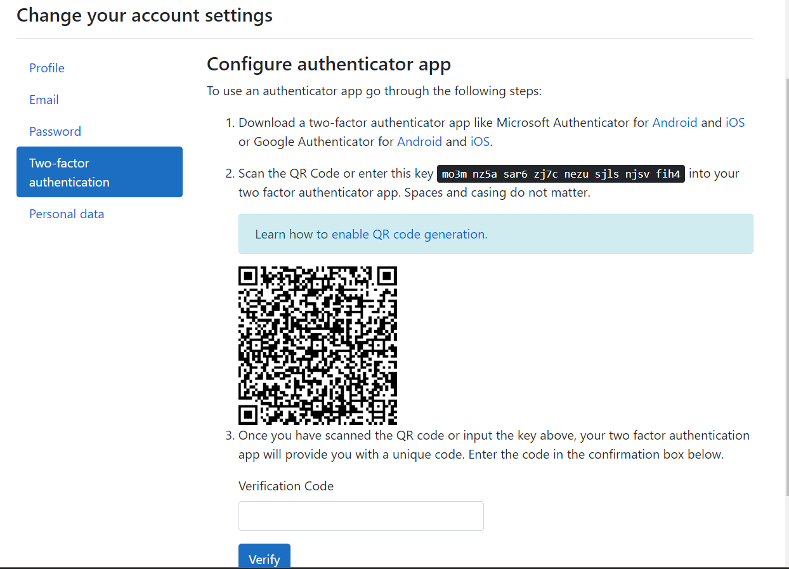
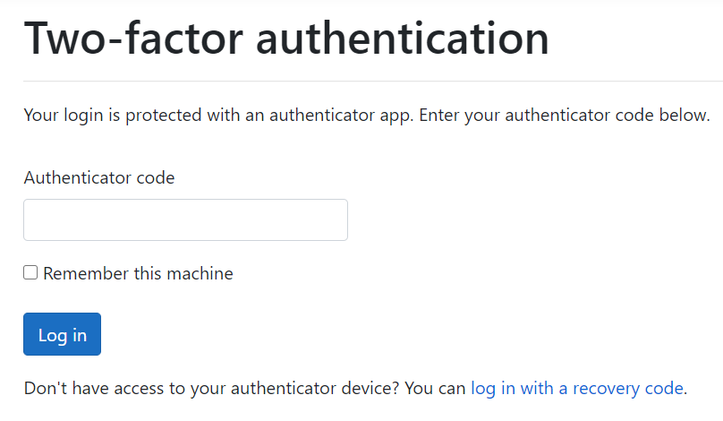

# Two-factor authenticatie

Om een extra beveiligingslaag toe te voegen aan een applicatie is het handig om two-factor authenticatie toe te voegen. Dit maakt het moeilijker voor hackers om in te breken bij een applicatie omdat ze niet alleen de inlog gegevens nodig hebben maar ook de tweede factor wat vaak vast zit aan een fysiek voorwerp. Een aantal voorbeelden van two-factor authenticatie zijn, vingerafdrukken, authenticatie apps op een mobiele telefoon of een usb-key.

## vingerafdrukken

Mijn originele idee was het uitlezen van de vingerafdruk scanner die in mijn laptop zit. Uit nader onderzoek blijkt dit vrijwel onmogelijk om te doen. Het is niet volledig duidelijk welke versie het is en wat de firmware hiervan doet. Alle bronnen op internet over mijn specifieke vingerafdruk scanner gaan over problemen oplossen. Aangezien ik geen externe vingerafdruk scanner heb laat ik dit idee even rusten.

## Microsoft identity

De backend van mijn applicatie is geschreven in Asp.net core. Hiervoor heeft microsoft het identity framework uitgebracht, dit framework maakt het makkelijker om authenticatie toe te passen. Dit lijkt de ideale oplossing voor mijn project en omdat het van microsoft komt is het ook een betrouwbare library. Het probleem is alleen dat identity framework alleen werkt met razor pages terwijl mijn frontend gemaakt is in angular.

## De afweging

Ik kan zou ervoor kunnen kiezen om de two-factor authenticatie toe te passen in angular. Dit betekent waarschijnlijk wel een minder betrouwbare library en een stuk meer moeite. De vraag is alleen hoe handig is het om two-factor authenticatie toe te passen om mijn project. Aangezien dit project gepentest moet worden door RedTeamers. Als ik de two-factor authenticatie zelf instel moeten de red teamers telkens vragen om de code, die ik dan door moet sturen. Vervolgens moet deze dan ingevuld worden met het risico dat deze code ondertussen verlopen is. Het is ook mogelijk om de two-factor authenticatie optioneel te maken. De vraag is dan alleen gaat het gebruikt worden tijdens de pentest. Het antwoord is waarschijnlijk nee. Ik zou dan eerst een duidlijke uitleg moeten schrijven waar ze het aan kunnen passen en vervolgens moet ik hopen dat ze het ook daadwerkelijk opvolgen. Deze reden hebben mij ertoe gedreven om te kiezen voor een proof of concept van de microsoft identity framework aanpak. Ik zelf vind dit ook meteen een waardevolle Toevoeging aan mijn kennis.

## De Proof of concept

Als eerste heb ik een Nieuwe Asp web applicatie gemaakt, hierbij heb ik aangegeven dat er ingelogd moet worden door individuele gebruiker. Vervolgens heb ik identity toegevoegd als new scafolding item, hierbij heb ik alle identity mogelijkheden aangevinkt. Om dit te laten werken moet de database worden geupdate. Ook moet identity geconfigureerd worden in startup.cs. Vervolgens heb ik de registreer en login functies getest. Daarna ben ik op de setting page gaan kijken. Daar vond ik de two-factor authenticatie pagina. Hier kan een two-factor autenticatie app worden ingesteld. Alleen de Qr code werkte niet. Wel kon je verbinden door middel van een key. Ik heb eerst een qr-code generatie script toegevoegd aan mijn programma. Dit heb ik vervolgens aangeroepen in de EnableAuthenticator razor page. Hierdoor werkte ook de qr-code op de two-factor authenticatie setup page.

{: }

Vervolgens heb ik uitgelogd en opnieuw ingelogd om te testen of de two-factor autenticatie ook echt werkt. Na het invullen van mijn gebruikers gegevens werd ik gevraag om een authenticatie code.

{: }