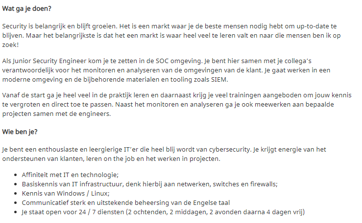

# Security engineering vacatures

## vereiste vaardigheden

Een netwerk security engineer moet bekend zijn met de meest gangbare protocollen zoals ssh,ssl https, smtp, dhcp enz.  vaak worden er ook certificaten gevraagd als oscp, ceh, cissp. Ook wordt er kennis gevraagt van windows en linux.

Een applicatie security engineer word ook vaak gevraagd om cyber security certificaten zoals oscp, maar ook meer certificaten die andere bedrijfstakken koppelen aan de cybersecurity als itil en asl. Daarnaast zijn er vaak branch specifieke eisen. Daarnaast wordt er vaak gevraagd om ervaring met het beveiligen van applicaties in de cloud.

## taken en verantwoordelijkheden

Een netwerk security engineer moet zorgen dat er een goede segmentering is van het netwerk en moet mogelijke netwerk problemen oplossen, hierbij moet er altijd op security gelet worden. Verder moet je vaak collega’s advies en uitleg geven over security en privacy.

De applicatie security engineer moet er voor zorgen dat er gewerkt word via security by design, moet risico analyses maken van bestaande applicaties en deze verbeteren. Daarnaast wordt er vaak gevraagd om ook de security van de ontwikkel straat te verbeteren. Ook moeten applicatie security engineers hun collega’s en klanten of stackholders uitleggen over security en privacy.

## aanpassingen leerplan

omdat veel vacatures vragen om een certificaat ga ik uitzoeken wat je voor die certificaten moet doen en hier alvast voor oefenen. Ik ga hier vooral kijken naar de certificaten die bij applicatie security engineering worden gevraagd omdat dat de richting is waar heen wil gaan. Veel certificaten zijn meer gericht op red en blue teaming. Het CSSLP certificaat is wel erg interessant. ook wil ik gaan kijken naar het CEH certificaat omdat dit meer theoretisch is en dus makkelijker vanuit huis te leren.

## voorbeeld vacatures

{: }

Veel vacatures zijn voor soc security engineers hierbij monitor je de veiligheid van een een applicatie en ga je de klant helpen met het oplossen van een probleem. veel van deze soc vacatures zijn in diensten. Zelf lijkt mij in een soc werken niet echt interessant. Ik ben niet echt fan van werkuren bij deze vacature omdat ik zelf liever wat meer werk als 24 uur per week.

{: }

Een andere optie als security engineer is de netwerk kant op gaan. Hierbij ben je vooral verantwoordelijke voor het installeren en configureren van netwerken. Zelf wat met een thuisnetwerk aan kloten en een thuis server opzetten vind ik wel leuk maar ik heb te weinig diepte kennis van netwerken om een netwerk security engineer te worden. Dit lijkt me interessanter als in een soc werken maar is denk ik ook niet de baan voor mij.

{: }

De derde optie als security engineer is een Applicatie security engineer. Dit type security engineer zit meer op het veilig ontwerpen en ontwikkelen van applicaties. Dit vind ik de interessantste vorm van security engineering die ook goed aansluit op mijn achtergrond als software engineer. Deze specifieke vacature combineert wat red teaming met het veilig ontwerpen en ontwikkelen van applicaties. Dit vind ik een mooie combinatie.
