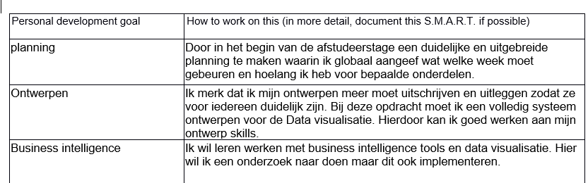

# semester evaluatie

Nu het semester ten einde loop is het tijd om te evalueren. Wat ging goed, wat ging minder, wat is er gelukt van mijn design en wat zou ik een volgende keer anders doen. Ik ga ook kijken hoe het met mijn leerdoelen staat, en of ik nu een beter kans maak op de arbeidsmarkt.

## implementatie vs design

| design         | implementatie |
| -------------- | ------------- |
| captcha        | ja            |
|time-outs       | nee           |
| encryptie      | AES           |
| SSL            | nee           |
| regex          | ja            |
| logging        | ja            |
| two factor     | nee           |
| error handling | ja            |
| jwt tokens     | ja            |
| code analyse   | ja            |
| fuzzing        | ja            |

De meeste onderwerpen uit mijn orignele design heb ik kunnen implementeren, 3 dingen zijn hierbij helaas niet gelukt. Dit komt voornamelijk door een gebrek aan tijd. Timeouts had ik voor mezelf al op een lage prioriteit gegeven omdat het van de drie extra inlog beveiligingen voor mijn gevoel de minst effectieven is. Captcha's en two factor autenticatie zijn effectiever en moderner. Van two factor autenticatie heb ik wel een prototype gemaakt met microsoft identity, Dit heb ik gedaan omdat identity alleen werkt met een mvc project en niet met een web api. Omdit toe te passen op mijn eigen applicatie zou ik heel de applicatie opnieuw moeten schrijven. Dit was tijds technisch gezien niet haalbaar. Voor een project in ASP.net core is microsoft identity eigenlijk wel de beste oplossing omdat het een grote library is met veel security features. Als ik dit semester opnieuw zou moeten doen zou ik zeker identity gebruiken omdat het meerdere beveiligingen automatisch inbouwd en omdat het goed werkt met entity framework. Ik ben bezig geweest met het toevoegen van een SSL certificaat aan mijn docker maar hierbij ontstonden een hoop errors waardoor ik dit heb moeten laten gaan om andere leerdoelen af te kunnen maken. Wel heb ik gezorgd dat alle data versleuteld is.

## testing

Uit de pentest is gebleken dat ik wat uitvoeriger moet testen, het gaat hier vooral om unit testen met foute of dubbele waarden. Ik heb dit semester niet geunit test omdat ik het belangrijker vond om met nieuwe technieken bezig te gaan. Zo heb ik dit semester gewerkt met fuzzing en secure code analysis. Ik heb al eerder gewerkt met sonarqube maar het security aspect is nieuw voor me. Bij software engineering gaat het vooral om code netheid. Ook heb ik voor het eerst gefuzed. Dit heb ik deels gedaan met burp suite en deels door het schrijven van unit testen. In het vervolg zou ik deze testen opnemen in mijn pipeline. Ik weet alleen niet of het kan met de burp suite testen.

## Security level

Het security level wat ik mijn applicatie zou geven is .... , Dit is nog niet het level wat van een bank-applicatie verwachtword maar Dat is ook niet haalbaar voor 1 engineer in 16 weken. Normaal worden dit soort apps gemaakt door een team in een langere periode. De risico's die blijven zijn : DDOS, phishing, hacktivists en state actors. DDoS blijft omdat er geen loadbalancing of backup servers zijn, ook heb ik niks gedaan aan de firewall, deze is ingelsteld door Casper. Phishing blijft altijd een risico en vereist bewustwordings campanges, iets wat ik niet op kan zetten voor de denkbeeldige gebruikers. Hacktivists en State actors blijven een risico omdat dit vaak de meer kundige hackers zijn die grote campanges tegen een bedrijf kunnen opzetten. Hierbij zijn vooral Zero days nog een risico. Wat verbeterd kan worden aan het security level is meer en beter logging en error handling, een SSL certificaat en two-factor autenticatie. ook moet de log server op een andere vm draaien als de applicatie zodat hackers deze niet zo snel vinden.

## leerdoelen en activiteiten

Hier ga ik terug kijken naar mijn leerdoelen en de activiteiten die ik daarvoor heb gedaan. hierbij ga ik de categorieen af van mijn leerplan.

### technische vaardigheden

Dit semester wou ik dieper ingaan op de security aspecten die we al bij software engineering hebben gehad. Voor mijn is dit goed gelukt. Ik heb nu meer kennis over het maken van veilige applicaties als vorig semester en dit voeg voor mij ook echt waarde toe aan mijn opleiding. Ik wou meer leren over cryptografie, ik had wat kennis van encryptie methodes maar dit was niet echt toegepaste kennis, ook waren dit vooral oude encryptie methodes zoals de scytale en de enigma. Dit semester heb ik kennis opgedaan over RSA en AES. Dit blijf ik erg interessant vinden en ik wil eigenlijk meer encryptie puzzels gaan doen. Als laatste had ik hier staan dat ik ook wou leren reverse engineren, Deze presentatie is alleen twee keer uitgesteld waardoor ik weinig tijd had om hiermee aan de slag te gaan.

### procedurele vaardigheden

De procedurele vaardigheden waar ik aan wou werken waren rapporteren en security testing. Het testen heb ik aangewerkt door middel van een secure code analyse en fuzing. Het rapporteren heb ik aan gewerkt doormiddel van dit portfolio, de website, het artikel en Het smartscreen pentest rapport. Ik denk dat ik nog voldoende ruimte heb om door te groeien in mijn procedurele vaardigheden maar er is dit semester zeker verbetering in gekomen.

### professsionele houding

Het plan was om meer uit te gaan van security by design. Dit semester ben ik begonnen met het maken van een risico analyse, misusecase en een privacy impact analyse. Vanuit daar ben ik mijn leerplanning gaan vullen. Wat dat betreft heb ik gewerkt vanuit security by design. Ik moet de security by design beter uitschrijven, ik doe veel dingen in mijn hoofd en die neem ik dan aan voor logisch. Dit moet ik voorkomen.

### zachte vaardigheden

Dit semester wou ik werken aan feedback vragen. Dit heb ik in het begin veel gedaan, hiermee heb ik voor mezelf bewezen dat ik het wel kan als ik er voldoende aan denk. halverwege het semester ben ik meer terug gevallen in mijn oude patroon. Dit vind ik zelf erg jammer en dit is dan ook iets waar ik aan moet blijven werken. Verder wou ik werken aan mijn presentatie vaardigheden, dit heb ik gedaan door twee keer de sprint retrospective te presenteren. De tweede keer heb ik gekeken naar de feedback van mijn groeps genoten en deze in acht genomen.

### leerdoelen voor mijn Afstudeer stage

{:}

dit semester is voor mij gebleken dat ik wat strakker moet leren plannen en mijn ontwerpen meer moet uitbreiden, ik doe teveel stappen in mijn hoofd en die moet ik ook uitschrijven zodat het ontwerp voor iedereen duidelijk is.

### positie arbeidsmarkt

Ik heb door dit semester meer ervaring opgedaan in het ontwerpen en stimuleren van veiligheids verbeteringen, technische ervaring opgedaan over de web applicatie veiligheids dicipline. Verder heb ik ervaring opgedaan in het communiceren van veiligheids risico's en het maken van strategieen om ze op te lossen. Daarnaast heb ik ook ervaring opgedaan in het beorordelen van applicaties. Ook heb ik mijn kennis van vulnerabilities uitgebreid en met meer tools gewerkt. Wat ik nu nog nodig heb om te voldoen aan de vacatures voor software security engineer zijn vooral werkervaring en vaak een certificaat.
