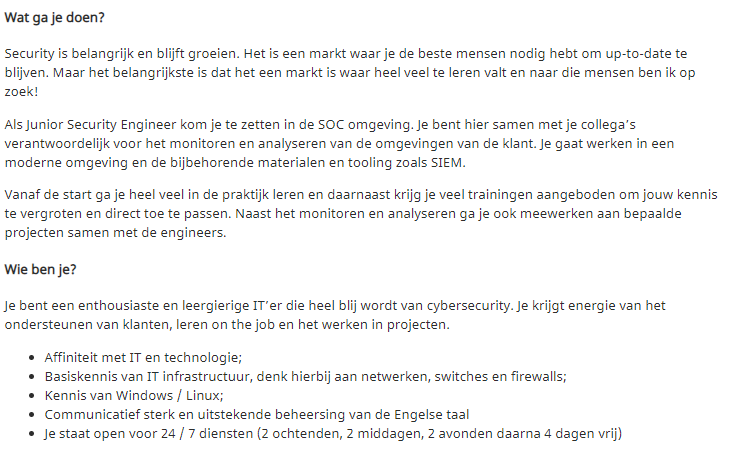
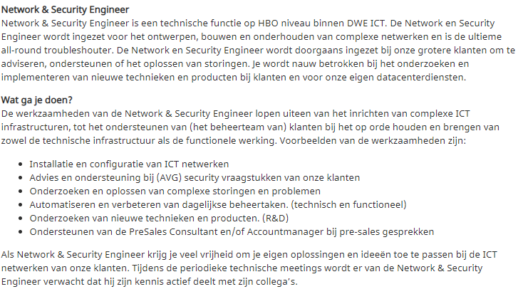
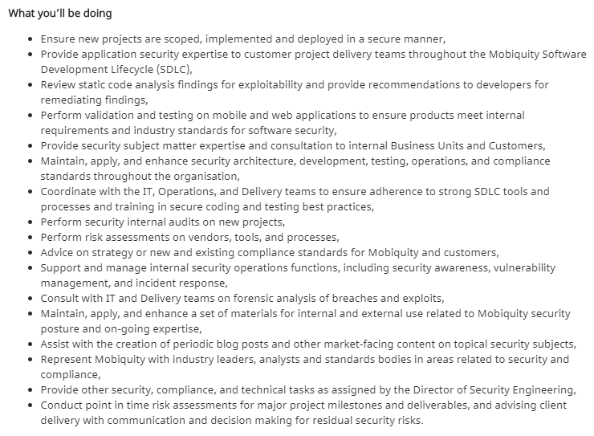

# Security engineering vacatures

## SOC security engineer

{: }

Veel vacatures zijn voor soc security engineers hierbij monitor je de veiligheid van een een applicatie en ga je de klant helpen met het oplossen van een probleem. veel van deze soc vacatures zijn in diensten. Zelf lijkt mij in een soc werken niet echt interessant. Ik ben niet echt fan van werkuren bij deze vacature omdat ik zelf liever wat meer werk als 24 uur per week.

## netwerk security engineer

{: }

Een andere optie als security engineer is de netwerk kant op gaan. Hierbij ben je vooral verantwoordelijke voor het installeren en configureren van netwerken. Zelf wat met een thuisnetwerk aan kloten en een thuis server opzetten vind ik wel leuk maar ik heb te weinig diepte kennis van netwerken om een netwerk security engineer te worden. Dit lijkt me interessanter als in een soc werken maar is denk ik ook niet de baan voor mij.

## application security engineer
{: }

De derde optie als security engineer is een Applicatie security engineer. Dit type security engineer zit meer op het veilig ontwerpen en ontwikkelen van applicaties. Dit vind ik de interessantste vorm van security engineering die ook goed aansluit op mijn achtergrond als software engineer. Deze specifieke vacature combineert wat red teaming met het veilig ontwerpen en ontwikkelen van applicaties. Dit vind ik een mooie combinatie. Omdat dit mij het meest interesseert staan hieronder nog twee andere applicatie security engineer vacatures.

### facebook security engineer, Enterprise Engineering

Iedereen kent facebook wel, het is een van de grootste socialmedia bedrijven ter wereld. Om hun socialmedia sites veilig te houden hebben ze natuurlijk ook Applicatie security Engineers nodig. bij facebook doe je de volgende dingen:

* Ontwerp en stimuleer veiligheids verbeteringen over meerdere interne tools, frameworks en applicaties.
* Bouw blijvende relaties op met product en engineering leiders.
* leidt veiligheids risico beslisingen en beinvloed de techinische architectuur.
* ben de eerste liaison tussen de engineering teams en het facebookbeveiligingsteam.
* Ontwikkel en onderhoud grote industrie expertise, als wel als expertise over facebook veiligheid mogelijkheden.
* voer veiligheids reviews uit voor interne services, identificeer risico's en stel oplossingen voor.

de eisen van facebook zijn als volgt:

* 7 jaar of meer ervaring met gegevens beveiliging
* Technische ervaring over meerdere veiligheids diciplines zoals web applicaties, mobile, infrastructuur, hardware, etc.
* Ervaring met interpreted of compiled programming languages
* Ervaring in het communiceren van veiligheids risico's en plannen om ze aan te pakken met het senior management.
* Ervaring in het opbouwen van relaties met key stakeholders en bedrijfsleiders.
* Applicatie beoordelings ervaring voor full-stack web-based en mobile applicaties.
* Ervaring met beveiliging op de schaal van facebook.
* Ervaring in threat modelerings technieken zoals STRIDE.

### WeTransfer Application Sercurity Engineer

WeTransfer is een van de grotere webtransfer bedrijven ter wereld met dagelijk miljoenen gebruikers. Omdat WeTransfer veel gebruikt wordt voor bedrijfs en persoonlijke gegevens is security een belangrijk aspect. hierbij zoeken ze iemand die voldoet aan de volgende eisen:

* kennis van bekende en minderbekende vulnerabilities(OWASP top 10, etc)
* Kennis van veelgebruikte veiligheids standaarden en frameworks(ISO 27001, NIST, etc)
* bekend met security analyse tools - alles van burp suite tot kibana tot de verschillende tools van AWS
* enige bekendheid met Ruby/Rails/Sinatra/React
* Enige bekendheid met AWS systemen
* Bereidheid om uit te leggen en te leren
* Sterke verbalen en geschreven communicatie vaardigheden(engels)

## aanpassingen leerplan

omdat veel vacatures vragen om een certificaat ga ik uitzoeken wat je voor die certificaten moet doen en hier alvast voor oefenen. Ik ga hier vooral kijken naar de certificaten die bij applicatie security engineering worden gevraagd omdat dat de richting is waar heen wil gaan. Veel certificaten zijn meer gericht op red en blue teaming. Het CSSLP certificaat is wel erg interessant. ook wil ik gaan kijken naar het CEH certificaat omdat dit meer theoretisch is en dus makkelijker vanuit huis te leren.
