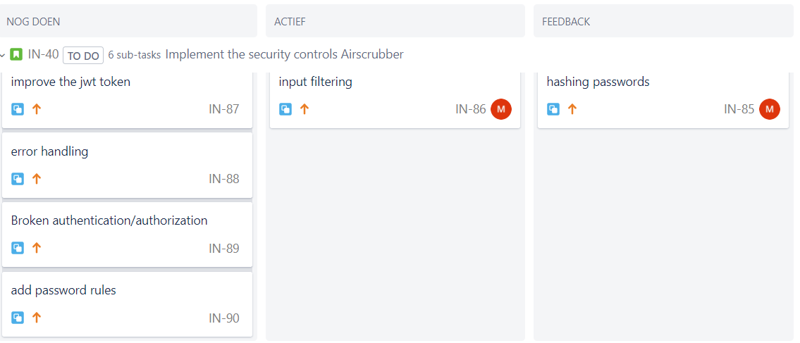

# Airscrubber

Vanuit school hebben we toegang gekregen tot het Airscrubber project. Dit is een project gemaakt door andere studenten van FHICT. Ons doel voor dit project is het pentesten van de Airscrubber en mogelijke verbeteringen toevoegen.

## pentest

onze groep bestaat voornamelijke uit red teamers en omdat dit project vrij klein is om met zeven man te testen ben ik vooral gezet op het vinden van de oorzaak van errors en bugs. Dit past goed bij mijn achtergrond als developer en vind ik ook niet erg om te doen. 

Rick had een bug gevonden waarbij je in de admin pagina geen admins aan kon maken maar wel farmers. aan mij de vraag om dit te onderzoeken. Eerst ben ik de backend gaan debuggen om te kijken bij welke functie het probleem zat omdat Rick en ik dachten dat het een backend probleem zou zijn. Toen ik de methode had gevonden bleek er bij het aan maken van een admin een lege roll property mee gestuurd te worden. het probleem zat dus in de frontend.

Ik ben vervolgens opzoek gegaan naar de juiste methode in de frontend en of de frontend wel een rol meestuurt. hier bleek al snel dat de frontend ook geen rol mee stuurt. door te kijken naar de code ben ik er achter gekomen dat hoewel op de pagina de rol standaard op admin staat de rol parameter in de code leeg is. dit probleem kon dus omzeild worden door de rol te veranderen. Dit voegde als waarde toe dat er nu bewijs was dat je als farmer ook een admin kunt aanmaken.

## ontwerp

Nadat de airscrubber geanalyseerd is door de pentesters op mogelijke kwetsbaarheden is het tijd om een ontwerp te maken hierbij hebben we gebruikt gemaakt van misuse cases. Deze zijn gemaakt door Hristo en mijzelf waarna ze gecontroleerd zijn door 2 andere groepsleden. De feedback van deze groepsleden heb ik vervolgens verwerkt. Uit deze misusecases zijn een aantal te nemen maatregelen naarvoren gekomen. van de kwetsbarheden in combinatie met de maatregelen heb ik Jira tickets gemaakt.

{: }

## implementatie

Ik ben begonnen met het implementeren van wachtwoord hashing, ik ben hiermee begonnen omdat het een relatief kleine verbetering is met een redelijke impact. Hierbij heb ik gebruik gemaakt van de in Java ingebouwde PBKDF2 functie. De wachtworden worden gehashed en gesalt en dan opgeslagen in de database. Als iemand dan probeert in te loggen wordt er niet langer gezocht naar een user in de db met een matchende username en wachtwoord maar wordt de user bij de username gezocht en vervolgens worden de gehashte wachtwoorden vergeleken. De oude methode was erg onveilig. De nieuwe methode is code technisch niet de mooiste oplossing maar daarvoor zou een groot gedeelte van het airscrubber project gerefactord moeten worden waar geen tijd voor is.
