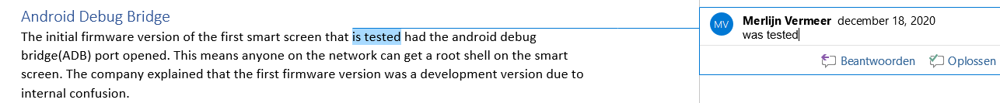

# Artikel

Voor het symposium moeten alle groepsleden een artikel schrijven en hieruit kiezen we als groep de beste. Zelf heb ik besloten om een artikel te schrijven over de smartscreen pentest. Ik heb hiervoor gekomen omdat veel met deze pentesten betrokken ben geweest en omdat ik een groot deel van het stuk op onze site geschreven heb en ik deze nog verder uitgebreid wou hebben. Dit heb ik ook gedaan omdat casper onze groep aanraden dit te doen.

## Het artikel

Ik ben begonnen met de tekst die ik geschreven had op onze site, Deze heb ik verder uitgebreid en verduidelijkt omdat het artikel voor iedereen te lezen moest zijn. Vervolgens heb ik een inleiding en conclusie gemaakt. Na even afstand te hebben genomen heb ik het artikel nogmaals zelf doorgelezen om de ergste fouten eruit te halen. Ik heb hierbij even afstand genomen om er met een frisse blik op te kijken anders lees ik teveel over de fouten heen. Vervolgens heb ik mijn artikel op de drive van onze proftaak groep gezet. Hierbij heeft Merlijn feedback gegeven op het artikel.

{:}

Nadat ik deze feedback verwerkt heb, heb ik mijn artikel naar mijn moeder gestuurd om ook een niet technische onderlegde persoon feedback te laten geven. Deze feedback heb ik ook verwerkt en hierdoor heb ik een aantal termen beter uitgelegd. Dit zorgt ervoor dat iedereen het artikel kan lezen.

{:}