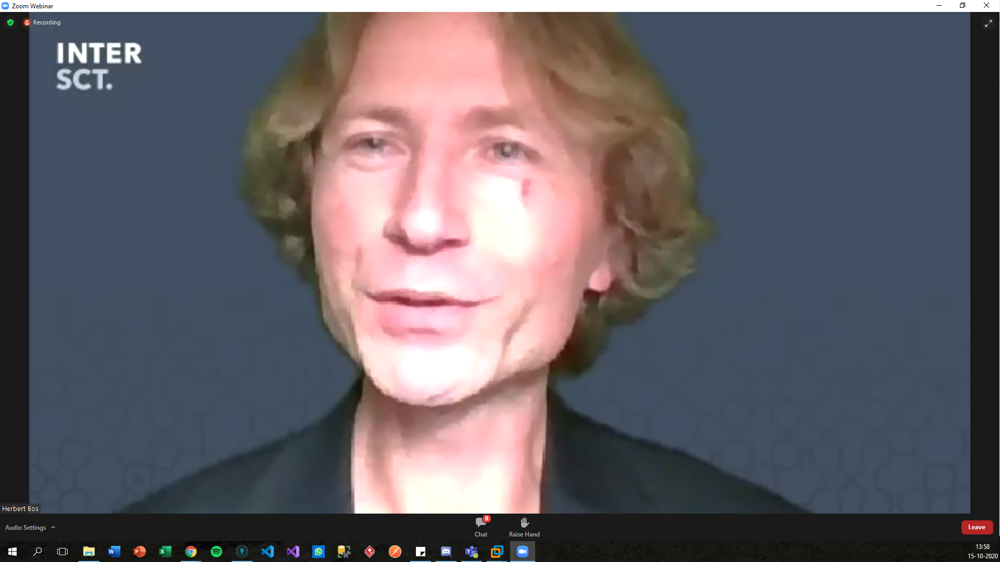
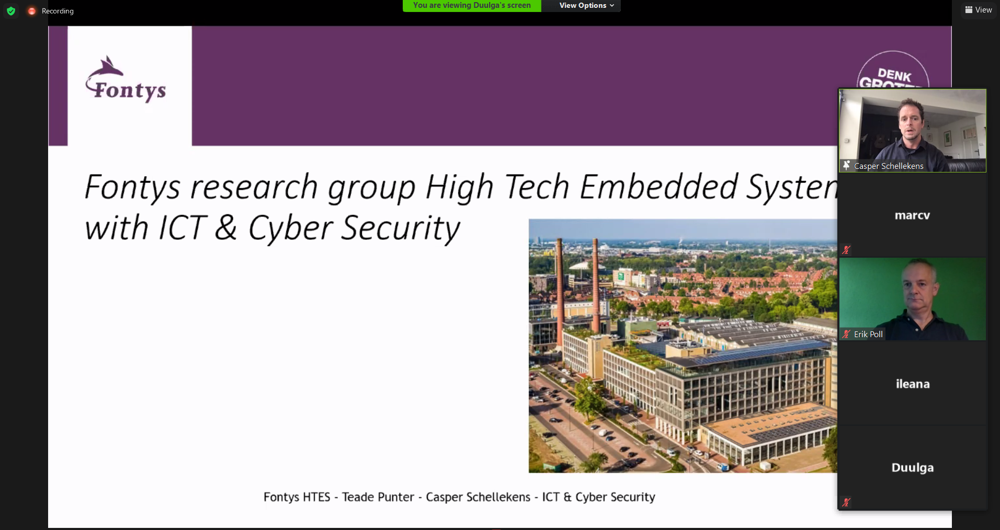

# Intersct20

Intersct organiseert jaarlijks een seminar waar professoren en professionals praatjes houden over de toekomst van IOT devices en hun beveiliging. Dit jaar vanwege de risico's rond Corona kon het seminar niet doorgaan, Inplaats hiervan hebben ze een webinar georganiseerd. Ik heb deze Webinar gevoligd op wo 14-10 en do 15-10. hierbij heb ik vooral gekeken naar de onderdelen die interesant zijn voor het groepsproject en mij zelf.

## dag 1
De eerste presentatie ging over een Software Bill of Materials(SBOM) en waarom het goed zou zijn om dit als bedrijf te implementeren. Zelf vind ik dit een erg goed plan omdat er zo meer overzicht komt bij het zoeken naar fouten in code. Door een SBOM kan een bedrijf meteen zien of ze gebruik maken van een library waar een nieuwe zwakte in is aangetoond. Zo kan een bedrijf zo snelmogelijk actie ondernemen en het bespaart ook nog eens de kosten van een stel programmeurs die handmatig moeten gaan zoeken naar de desbetreffende library wat soms uren kan duren omdat sommige libraries andere libraries gebruiken.

De tweede presentatie ging over het feit dat we niet kunnen verwachten dat alle consumenten software en hardware beveiligings experts zijn. Dit betekent dat de bedrijven en de overheid moeten zorgen dat de veiligheid op een hoger niveau zit. Dit vond ik wat minder interesant.

Het volgende onderwerp was DDOS en IOT, Deze presentatie was weer een stuk interessanter alhouwel ik afentoe moeite had om de presentator te volgen. Het ging hier over hoe IOT device worden gebruikt om dingen te DDOSsen en wat dit voor risico's en toekomst met zich mee brengt.

Van de parralel sessies heb ik WP2 gevolgd omdat deze het beste bij mijn richting van de minor pasten. Dit was opzich ook een nuttige presentatie maar ik merkte wel dat ik wat aandacht begon te verliezen door het velen luisteren naar presetaties. Niet iedere presetator tijdens deze presentatie was even nuttig maar uit het geheel heb ik wel het een en ander gehaald.

ik ben helaas vergeten schreenshot te maken op dag 1.

## dag 2

de eerste presentatie van de laaste dag van intersct20 ging over wat we nu moeten doen terwijl er nog geen structureel veilige IOT devices worden geproduceerd. Veel IOT devices komen uit china en hebben niet de juiste veiligheids maatregelen in de hardware en software zitten. Wie zou er moeten handelen en wie heeft een motief om te handelen naar een veiligere IOT wereld.

de volgende presentatie ging over threat models en de fouten die hier vaak bij worden gemaakt. Ook wordt er hierbinnen gesproken over abstractie en de impact hiervan op threat models. Deze presentatie vond ik wel interesant maar een beetje abstract.

 {: }

De volgende sesie die ik heb gevolgd is de parralle sesie waarbij ik WP7 heb gevolgd. In deze sessie gaven bedrijven en universiteiten/hogescholen aan wat hun plannen en aanpak is met betreffing tot IOT en security. Dit geeft intressante kijk op de huidige stand van zaken maar heeft niet direct practische waarden. ook vanuit Fontys werd er gepresenteerd.

 {: }

De laaste presentatie die ik heb gevolgd is de sesie over IOT in bijvoorbeeld de zorg. Deze heb ik gevogld omdat deze mogelijk toegevoegde waarde had voor het groepsproject. Helaas heb ik hier voor mijn gevoel minder nuttige informatie uitgehaald dan ik had gehoopt.

Over het algemeen vond ik het nuttig om deze webinar bij te wonen, niet alle presentatie waren helemaal mijn ding maar ik heb er zeker het een en ander uitgehaald. 
