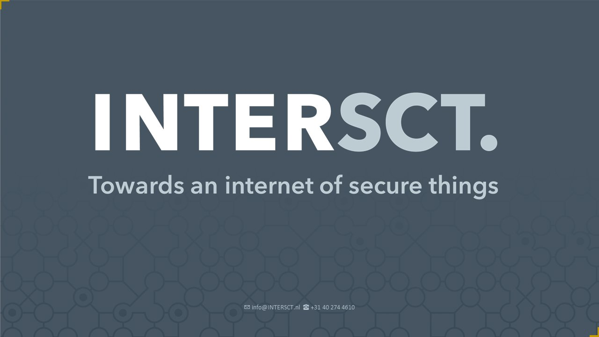

# intersect

Het Research en development(R&D) project waar ik dit semester aan mee werkt is het project van Intersect. Dit project is een set guidelines voor IoT devices binnen Smart industrie, Smart mobility, Smart health and Smart city. Intersect is een onderzoek dat wil zorgen voor meer veiligheid bij IOT devices.

aan het begin van dit semester hadden we een aantal projecten om uit te kiezen om onderzoek naar te doen. Aan ons was de vraag om een top drie te maken, voor mij persoonlijk was intersect mijn eerste keuze. IOT is iets wat mij al langer intereseert en waarvan ik ook zie dat het een groeiend onderdeel is van onze maatschappij. Mijn persoonlijke bezwaar is alleen altijd geweest dat de meeste IOT devices absoluut niet veilig zijn. Om er zelf aan bij te mogen dragen om De IOT devices veiliger te maken is dan natuurlijk erg interesant.

## ethische analyse

Om een beter beeld te krijgen van de impact van dit project heb ik eerst een eigen etische analyse gemaakt. Dit heb ik gedaan via de TICT tool van fontys. hierbij heb ik gekeken naar de Impact van dit project op de gebruikers, hoe mensen het kunnen misbruiken en naar eventuele onbedoelde bijkomendheden. Hierbij moet gedacht worden aan de impact op het mileu maar ook de vooroordelen die mogelijkerwijs in het project kunnen staan. de volledige analyse kan [hier](../pdfs/TICT_Intersect.pdf) gevonden worden.

## onderzoeks aanpak

Daarna heb ik nagedacht over hoofd en deel vragen en welke methodes van het DOT framework hierbij gebruikt kunnen worden. Dit heb ik opgeschreven en daarna hebben we het besproken met de groep om samen tot een hoofdvraag te komen. daarna hebben we alle deelvragen samengevoegd en besloten welke DOT methodes we gebruiken om alles te trianguleren. Mijn volledige research approach kan [hier](../pdfs/Marc_research_approach.pdf) gevonden worden.
