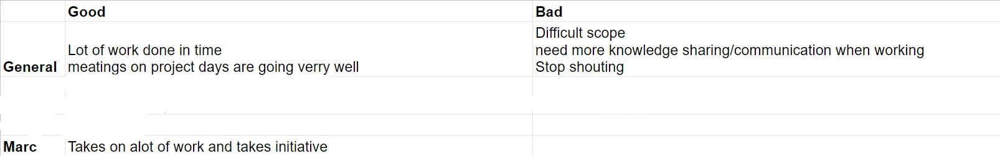
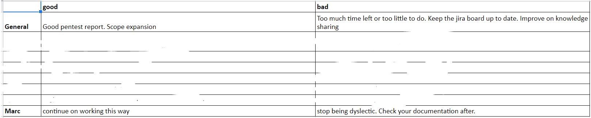
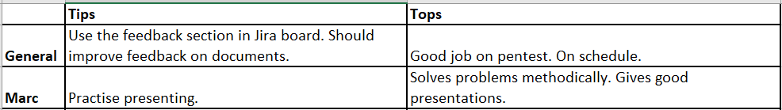

# peer reviews

aan het eind van iedere sprint kijken we als groep terug op het functioneren van onze leden. op deze pagina ga ik de feedback van mijn medestudenten per sprint laten zien en hier kort een stukje over schrijven.

## sprint 0

{: }

Ik ben het de algemene feedback, we moeten als groep wat meer knowledge sharing doen en we hebben een aantal mensen met een sterke mening die de rest wat kunnen over schreeuwen. Ik zelf ben een van deze mensen en ga er dus aan werken om de komende sprint wat rustiger te praten en meer om de mening van rustigere groepsgenoten te vragen.

Met mijn eigen feedback ben ik blij, want het is natuurlijk fijn om te horen dat je groep je waardeert.

## sprint 1

{: }

Ik vind het goed dat we deze sprint duidelijke stappen hebben genomen om  de scope uit te breiden omdat we te veel dagen in deze sprint hebben gehad waarbij mensen niet wisten wat ze konden doen. 

omdat ik dyslecties ben moet ik extra letten op mijn spelling en mijn documentatie altijd even na lopen op spelling hier hebben mijn groepsgenoten gelijk in. Ook kan ik altijd iemand vragen om mijn spelling na te lopen.

## sprint 2

{: }

Deze sprint ben ik tot de ontdekking gekomen dat we niks of nauwelijks iets doen met de feedback colom van ons jira board. Hierdoor blijven er fouten zitten in de documenten en in de code.  Verder ben ik het er mee eens dat we de pentesten goed en uitvoerig hebben uitgevoerd en denk ik ook dat we goed op schema lopen.

Ik ben blij met het feit dat mijn groepsgenoten de presentatie goed vonden gaan. Het feit dat ik meer moet oeffenen zal ik onthouden. Normaal doe ik dat wel meer, maar deze keer had ik geen tijd om zelf de presentatie te maken omdat ik nog met een andere belangrijke taak bezig was.
