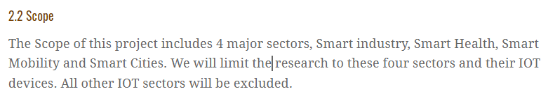

# onderzoeksaanpak

Nadat we allemaal een individuele onderzoeksaanpak hadden bedacht en nadat we een vooronderzoek hadden opgesteld zijn we gaan werken aan een onderzoeksaanpak. Hierbij heb ik de scope van ons project aan toegevoegd, ook heb ik de planning uitgebreid. Daarnaast heb ik een korte beschrijving toegevoegd van ons scrum board.

## De scope

Om duidelijke te maken waar ons project op van toepassing is en waarop niet moet er een duidelijke scope zijn. Daarom heb ik deze beschreven in de groeps onderzoeksaanpak.

## De planning

Onze oude planning was al door iemand in het document gekopieerd, maar deze planning misten een heel aantal deadlines en had nog wat onderdelen in verkeerde sprints staan.

## Scrum

Ons scrum board is gemaakt en gevuld door onze scrum master, hierbij hebben we er met de groep nog eens doorheen gelezen om bepaalde onduidelijke stories beter op te schrijven. In de scrum beschrijving hebben ik gemeld hoelang onze sprints zijn en wanneer onze standups zijn. Verder heb ik ook de structuur van onze backlog uitgelegd en gelinkt naar een appendix waar de backlog instaat. Ons scrumboard heeft 4 kolommen, to do, doing, feedback and done. onze stories hebben subtasks. iedereen schrijft zich in voor een subtaak en zet deze naar de doing colom. Zo ziet de rest waar je mee bezig bent. Zodra dit klaar is verzet je de subtask naar feedback. Een ander groepslid kijkt je werk vervolgens na om er fouten en onduidelijkheden uit te halen. als je werk is goedgekeurt wordt het versleept naar de done kolom. Als alle subtasks compleet zijn wordt de storie verplaats naar done.
