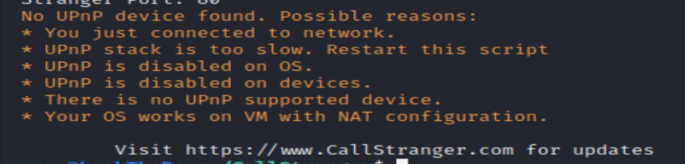

# Smart screen

een van de IOT devices die we mogen testen is een Smart screen. Ik heb hier samen met rick veel aan gewerkt. Hierbij heeft Rick, omdat ik geen pentester ben, veel gedaan aan kennis deling. Voor mij is dit een interessant uitstap om mijn kennis te verbreden en op meer plekken in het project betrokken te raken.

## android debug bridge

na een nmap scan zagen we dat de Android debug bridge(ADB) poort standaard open stond. Dit betekent dat er via het internet verbonden kon worden met de ADB. Ik heb hierbij onderzoek gedaan naar de mogelijkheden en beperkingen van de ADB. Het bleek dat het verbinden met de ADB poort erg makkelijk was. met een commando was het gelukt, zonder gebruik van een wachtwoord of code. Dit komt het scherm gebruik maakt van android 8. In latere android versies is er een code nodig voor een connectie via de ADB poort.

het eerste wat we geprobeerd hebben is een apk installeren op het scherm, als dit lukt is het namelijk mogelijk om een remote shell apk te maken en te installeren. Ook dit bleek erg simple met een comando.

Nadat we dit getest hadden ben ik verder gaan zoeken naar meer mogelijkheden met de ADB en hieruit kwam dat je ook een adb shell kan maken. Dit vraagt weer een commando en geeft je een root shell. Ook dit vereist geen wachtwoord of verificatie.

## Portable UPnP

het smart screen heeft meerdere poorten open staan voor een  Portable SDK for UPnP devices 1.6.19. een eerdere versie van deze SDK had buffer overflow vulnerabilities, maar deze zijn gepatched in 1.6.18. Dat gezegd hebbende is dit wel een verouderde versie van de SDK, dus een update zou aangeraden zijn. Uit naderonderzoek blijkt dat er meerdere kwetsbaarheden zijn voor versies na 1.6.19, voorbeelden hiervan zijn CallStranger en CVE-2016-6255. Ik heb CallStranger proberen uit te voeren op het bord maar het is tot nu toe nog niet gelukt om het script upnp poorten te laten vinden.

{: }

## Het Rapport

Samen met rick heb ik het pentest raport over dit smart screen geschreven. Hierbij hebben we allebei appart onderdelen geschreven en heb ik daarna heb ik het geheel door gelezen. Hierbij heb ik een aantal stukken aangepast om de wij vormen er uit te halen. Vervolgens heb ik aan de rest van de groep aangegeven dat dit document nagekeken mag worden.

Daarnaast heb ik met merlijn de pentest van het andere scherm door gesproken om te kijken of hij nog iets gemist had. Aan de hand hiervan hebben we nog een aantal extra nmap scans uit gevoerd die helaas niks extra's hebben opgeleverd.

## Het tweede scherm

Naast het scherm dat ik met rick getest heb hebben we nog een tweede scherm gekregen om ook te testen. Dit scherm heeft merlijn getest. Toen merlijn dacht dat hij alles getest had wat hij kon testen heb ik nog een dag erbij gezetten om met Merlijn alle stappen door te spreken en mogelijk nog andere invals hoeken te noemen. hierbij heb ik nog aan geraden om voor de zekerheid een udp scan te doen. Hier kwamen helaas geen open porten uit.
